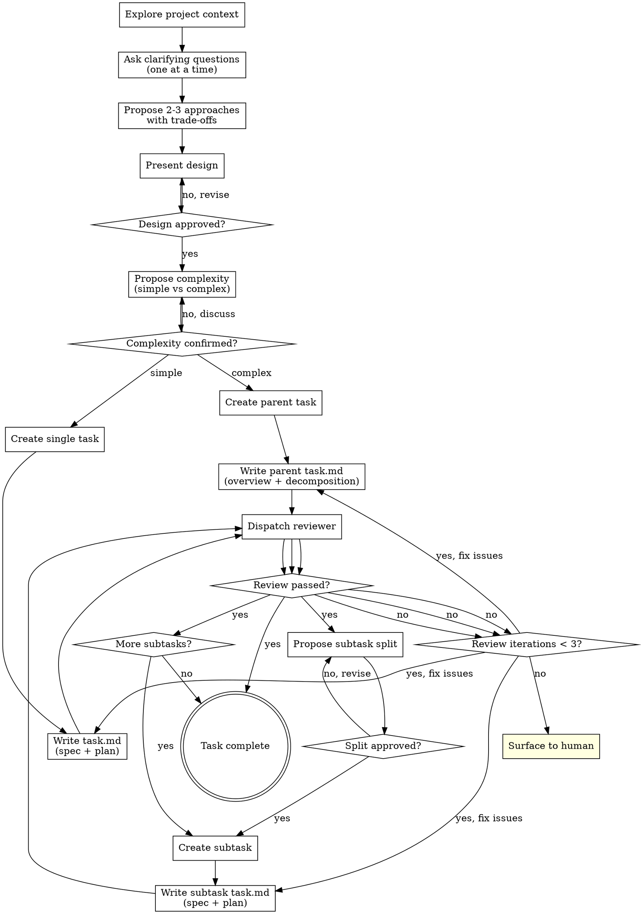

# Arching Tasks

Transform ideas into executable tasks through a structured, collaborative workflow.

**Core principle:** All user interaction happens during brainstorm. Task creation is autonomous and smooth.

## Overview

This skill guides you through:

1. **Brainstorm phase** (interactive) — Understand requirements, explore approaches, design solution, determine complexity
2. **Task creation phase** (autonomous) — Create tasks, write task.md, review with subagent

<HARD-GATE>
Do NOT create tasks, write task.md, or take any implementation action until:
1. Design has been presented
2. User has approved the design
3. Complexity (simple vs complex) has been confirmed
</HARD-GATE>

---

## Workflow



---

## Phase 1: Brainstorm (Interactive)

### 1.1 Explore Project Context

Before asking questions, understand the current state:

- Check relevant files, documentation, recent commits
- Identify existing patterns and conventions
- Note any related work or dependencies

**Do not assume.** Read files to validate assumptions.

### 1.2 Ask Clarifying Questions

**One question at a time.** This keeps the user focused and prevents overwhelm.

Guidelines:
- Prefer multiple choice when possible (easier to answer)
- Open-ended questions are fine when needed
- If a topic needs deeper exploration, break it into multiple questions
- Focus on: purpose, constraints, success criteria, edge cases

### 1.3 Propose Approaches

Present 2-3 different approaches with:
- Clear trade-offs
- Your recommendation with reasoning
- Lead with your recommended option

### 1.4 Present Design

Once you understand what to build, present the design:

- Scale detail to complexity (brief for simple, thorough for complex)
- Cover: architecture, components, data flow, error handling, testing
- Ask after each major section: "Does this look right so far?"
- Be ready to revise if something doesn't make sense

### 1.5 Complexity Determination

After design approval, propose complexity level:

**Simple (single task):**
- Can be completed in one implementation session
- Clear boundaries, no logical sub-components
- Single developer context

**Complex (parent + subtasks):**
- Multiple logical components that could be developed independently
- Sequential or parallel work streams
- Benefits from decomposition for clarity and review

Propose your assessment and rationale. User confirms or adjusts.

---

## Phase 2: Task Creation (Autonomous)

After complexity is confirmed, proceed autonomously without user interaction (except for subtask split approval).

### 2.1 Simple Task Flow

1. **Create task**
   ```bash
   fa task create <slug>
   ```

2. **Write task.md** — Full spec + plan (see task.md Structure below)

3. **Dispatch reviewer subagent** — See task-reviewer-prompt.md

4. **Handle review results:**
   - If approved: Task complete
   - If issues found: Fix task.md, re-dispatch reviewer
   - If 3+ iterations: Surface to human for guidance

### 2.2 Complex Task Flow

#### Parent Task

1. **Create parent task**
   ```bash
   fa task create <parent-slug>
   ```

2. **Write parent task.md** — Overview + decomposition (see Parent task.md Structure below)

3. **Dispatch reviewer subagent** and handle results (same as simple task)

4. **Propose subtask split** — Present decomposition to user for approval

#### Subtask Creation (after split approval)

For each subtask:

1. **Create subtask**
   ```bash
   fa task create <subtask-slug> --parent <parent-id>
   ```

2. **Write subtask task.md** — Full spec + plan

3. **Dispatch reviewer subagent** and handle results

4. Proceed to next subtask

---

## task.md Structure

### Single Task / Subtask task.md

```markdown
# [Task Title]

## Context

[Brief background and motivation. Why are we doing this?]

## Requirements

[What needs to be built. Be specific and measurable.]

- [ ] Requirement 1
- [ ] Requirement 2
- [ ] ...

## Design

[Architecture decisions, component breakdown, data flow]

### Components

- **Component A**: [Purpose, responsibilities]
- **Component B**: [Purpose, responsibilities]

### Data Flow

[How data moves through the system]

### Error Handling

[How errors are handled at each layer]

## Implementation

### Files to Create/Modify

| File | Action | Purpose |
|------|--------|---------|
| `path/to/file.py` | Create | [What this file does] |
| `path/to/existing.py` | Modify | [What changes] |

### Implementation Steps

- [ ] **Step 1: [Description]**
  - [Specific action with code/command if applicable]

- [ ] **Step 2: [Description]**
  - [Specific action]

## Testing Notes

[What to test, how to verify, edge cases to consider]

## Dependencies

[Any dependencies on other tasks, external libraries, or systems]
```

### Parent task.md Structure

```markdown
# [Parent Task Title]

## Context

[Overall background and motivation]

## Goal

[Single sentence describing what this accomplishes]

## High-Level Design

[Architecture overview, how components fit together]

### Component Breakdown

| Component | Purpose | Subtask |
|-----------|---------|---------|
| [Component A] | [What it does] | [Subtask slug] |
| [Component B] | [What it does] | [Subtask slug] |

## Decomposition

[Why this was split into subtasks, how they relate]

### Subtask Order

1. **[Subtask 1 slug]**: [Brief description] - No dependencies
2. **[Subtask 2 slug]**: [Brief description] - Depends on: [Subtask 1]

## Success Criteria

[How to verify the entire system works]

## Notes

[Any additional context for the implementer]
```

---

## Review Process

### Dispatching the Reviewer

After writing task.md, dispatch a review subagent:

```
Task tool (general-purpose):
  description: "Review task.md"
  prompt: |
    See skills/arching-tasks/task-reviewer-prompt.md for the full prompt template.
    Pass: task_file path, is_parent (true/false)
```

### Handling Review Results

| Result | Action |
|--------|--------|
| **Approved** | Proceed to next step |
| **Issues Found** | Fix issues in task.md, increment iteration counter, re-dispatch |
| **3+ iterations** | Surface to human: "Review loop exceeded 3 iterations. Please review task.md and provide guidance." |

### What the Reviewer Checks

For all tasks:
- Completeness (no TODOs, placeholders, TBDs)
- Clarity (requirements are unambiguous)
- Implementability (an engineer could follow the plan)

For parent tasks additionally:
- Decomposition quality (subtasks have clear boundaries)
- Dependency order (logical sequence)

For subtasks additionally:
- Alignment with parent (fits the overall design)
- Scope (not overlapping with siblings)

---

## Key Principles

1. **One question at a time** — Don't overwhelm the user
2. **All clarifications in brainstorm** — Task creation is smooth, no interruptions
3. **YAGNI ruthlessly** — Remove unnecessary features from designs
4. **Explore alternatives** — Always propose 2-3 approaches before settling
5. **Incremental validation** — Get approval before moving forward
6. **No git commits during skill** — User commits after workflow completes
7. **Surface blockers early** — If blocked during task creation, surface to human immediately

---

## Anti-Pattern: "This Is Too Simple"

Every project goes through this process. A config change, a single function, a quick fix — all of them. "Simple" projects are where unexamined assumptions cause the most wasted work.

The design can be brief for truly simple projects, but you MUST:
- Present the design
- Get user approval
- Go through the review loop

---

## File Locations

- Task files: `.fa/tasks/{id}-{mm-dd}-{slug}/task.md`
- Task metadata: `.fa/tasks/{id}-{mm-dd}-{slug}/task.json`
- Subtasks: `.fa/tasks/{parent-id}-{mm-dd}-{parent-slug}/{subtask-id}-{mm-dd}-{subtask-slug}/`

No intermediate files. Write directly to task.md.
